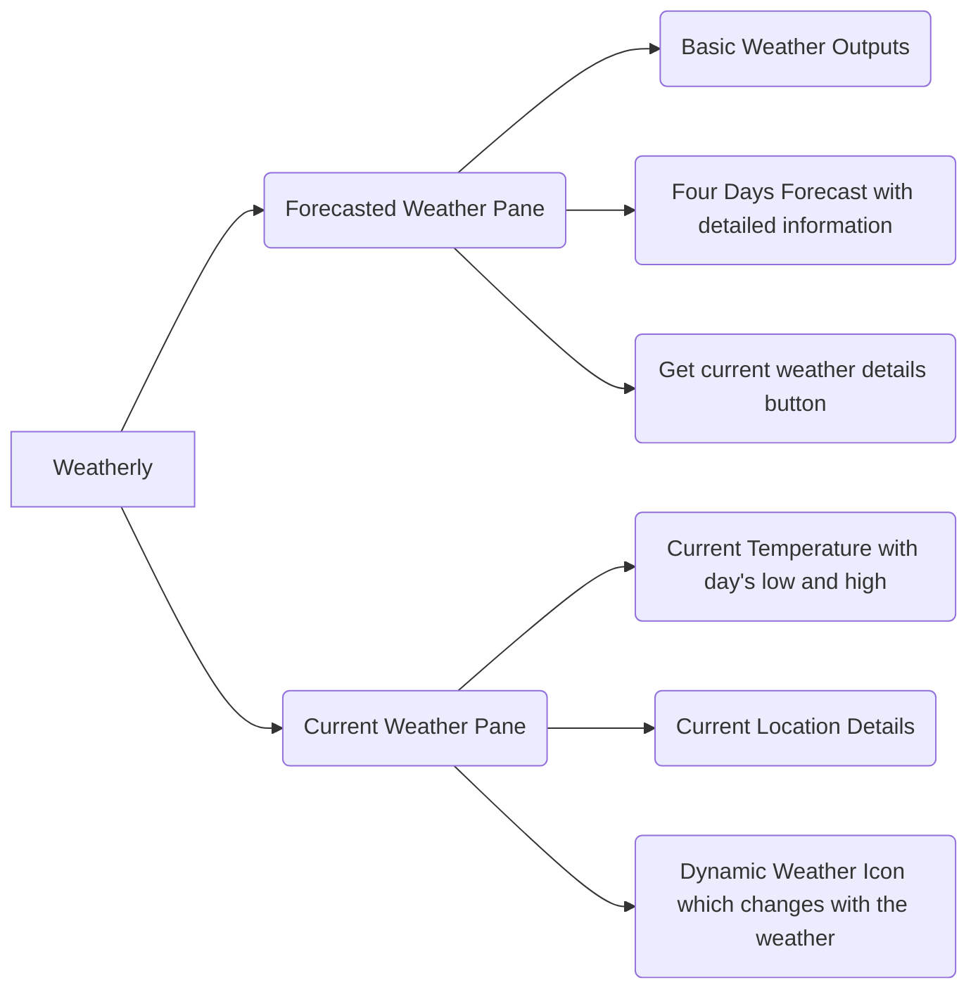

# Weatherly - Weather App in Python and PYQT5

  

Hi! 👋 I've created this cool and modern weather app using python and pyqt5. This helps in getting all weather information about a city along with few days of future forecast.

